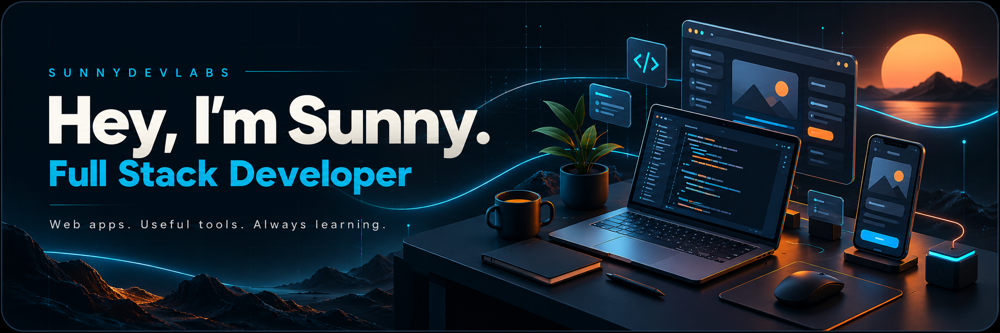
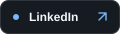
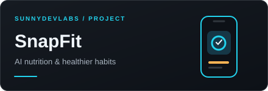
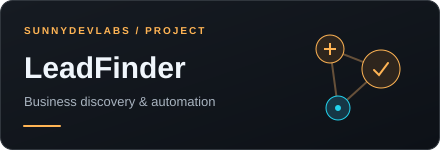

  &nbsp;
  &nbsp;
  &nbsp;
  

### A little about me

I'm **Sunny Alam**, a software engineering student at **UNITEN**, based in **Malaysia**. I build modern websites, mobile experiences, and useful tools under **SunnyDevLabs** — bringing ideas to life with clean code and thoughtful design.

- **Building:** web and app projects that solve everyday problems.
- **Exploring:** full stack development, AI integrations, and Python automation.
- **Growing:** my React, Next.js, Node.js, and Python skills through practical projects.
- **Let's talk:** web development, app development, UI/UX, and interesting things to build.

### Things I've been building

<table>
  <tr>
    <td width="50%" valign="top">
      
      
An AI calorie tracker and food scanner for Android, with meal logging, water tracking, macros, and progress tools.

      
<code>Mobile</code> <code>AI</code> <code>Firebase</code>

      <a href="https://snapfit-app.online/">Live website ↗</a> · <a href="https://github.com/sassunny555/snapfit-app.github.io">Website source ↗</a>
    </td>
    <td width="50%" valign="top">
      
      
A Python tool connecting Google Places discovery, website enrichment, lead scoring, and an email outreach workflow.

      
<code>Python</code> <code>Streamlit</code> <code>Automation</code>

      <a href="https://github.com/sassunny555/LeadFinder">Explore the project ↗</a>
    </td>
  </tr>
</table>

**More from my portfolio:** [SocialThumbPro](https://socialthumbpro.com/) · [Diginobo](https://www.diginobo.net/) · [The IELTS Exam](https://www.theieltsexam.com/) · [Al Mokaddam](https://al-mokadam-educational-agency.web.app/)

### Languages & tools

<table>
  <tr>
    <td width="50%" valign="top">
      <strong>Web development</strong>  
        
      HTML · CSS · JavaScript · TypeScript · React · Next.js
    </td>
    <td width="50%" valign="top">
      <strong>Backend &amp; workflow</strong>  
        
      Node.js · Python · Firebase · Git · GitHub · Figma
    </td>
  </tr>
</table>

### GitHub activity

  
  

  

Stats reflect the public data available to each service; language charts show repository code composition.

---

  <strong>Have an idea? Let's build something useful.</strong>  
  <a href="https://www.sunnydevlabs.site">Explore SunnyDevLabs ↗</a> &nbsp;·&nbsp; <a href="mailto:itsneodesign@gmail.com">Get in touch ↗</a>  
  Learning by building. Improving with every iteration.

